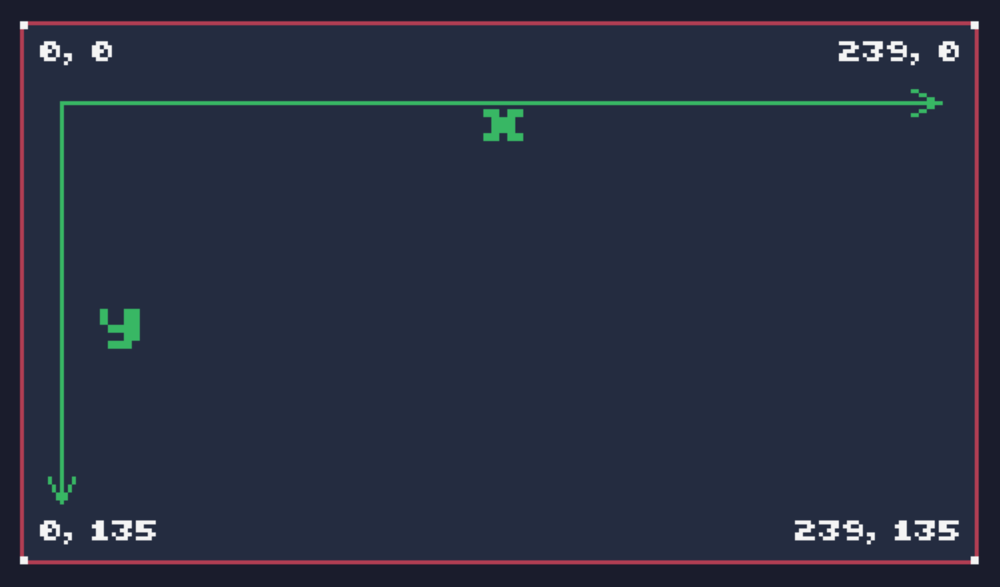
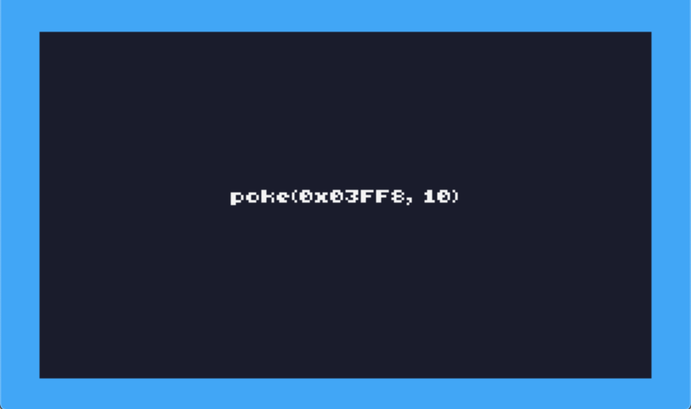

# Display

- [Coordinate System](#coordinate-system)
- [Border Color](#border-color)

## Coordinate System

TIC-80 has a native screen resolution of 240 pixels wide by 136 pixels tall, giving an aspect ratio of 30:17. This resolution is maintained when resizing, so any reference in code is considered to be at this "virtual" resolution, regardless of window size or monitor resolution.

The screen origin is at top-left, with x coordinates running left to right and y coordinates from top to bottom. Coordinates are specified as (x,y) pairs.

- (0,0) is the top left
- (239,135) is the bottom right



``` lua
-- title: coordinate system
-- author: PaulR
-- script: lua

function TIC()
 cls(15)
 poke(0x03FF8, 0)
 rectb(0,0,240,136,2)

 line(10,20,230,20,6)
 line(230,20,230-7,20-3,6)
 line(230,20,230-7,20+3,6)

 line(10,20,10,120,6)
 line(10,120,10-3,120-6,6)
 line(10,120,10+3,120-6,6)

 rect(0,0,2,2,12)
 rect(238,0,2,2,12)
 rect(0,134,2,2,12)
 rect(238,134,2,2,12)

 print("0, 0",5,5,12)
 print("239, 0",205,5,12)
 print("0, 135",5,125,12)
 print("239, 135",194,125,12)
 print("x",116,20,6,false,2)
 print("y",20,70,6,false,2)
end
```

## Border Color

When the actual window size is not a perfect match to the aspect ratio a border will be drawn around the outside.  This border color can be modified by poking  to `BORDER COLOR` in [RAM](ram):

```lua
-- border register is in VRAM 0
vbank(0)
-- set the border color to palette index 10
poke(0x03FF8, 10)
```

