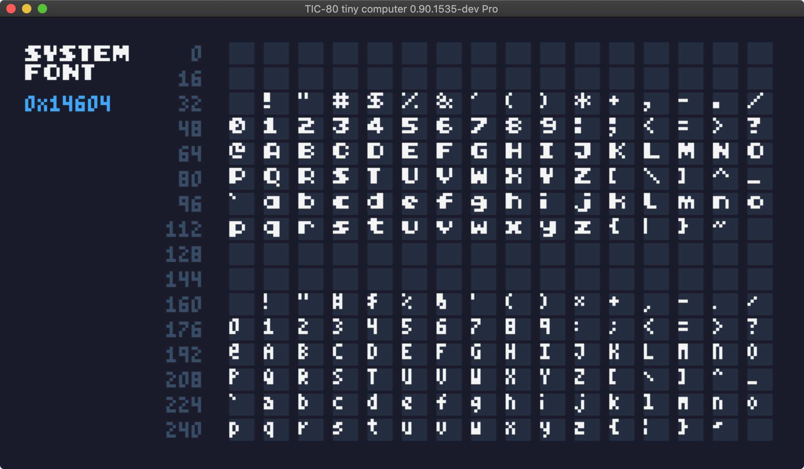

# System Font Demo



```lua
-- script: lua
offy=4
offx=65

function lpad(s, l, c)
    local res = string.rep(c or ' ', l - #s) .. s

    return res, res ~= s
end

function TIC()
  cls()
  print("SYSTEM\nFONT",0,5,12)
  print("0x14604",0,21,10,true,1,true)

  for x =0,15 do
    off = x*16
    print(lpad(off.."",3," "),
    offx-20,
    x*8+offy+1,14,true,1, true)
    for y =0,15 do
      char = y*16+x
      rect(x*11+offx,y*8+offy,8,7,15)
      print(string.char(char),
      x*11+offx,
      y*8+offy,12)
    end
  end
end
```